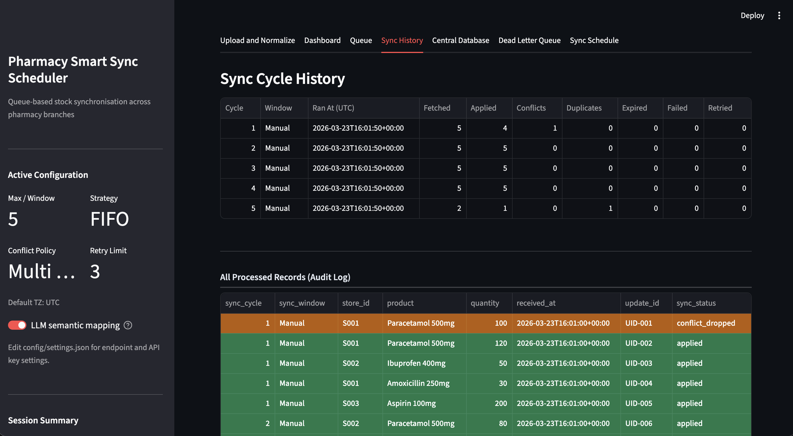
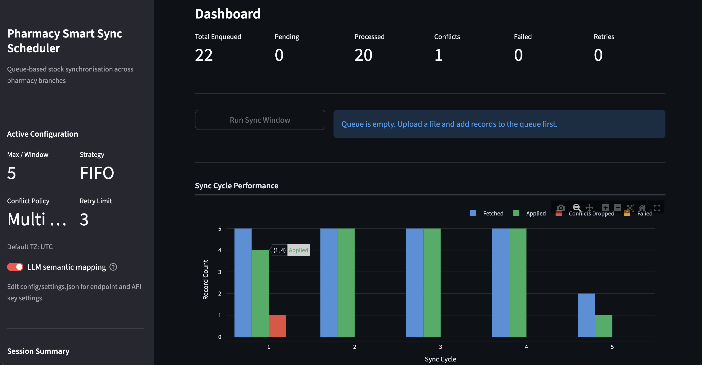
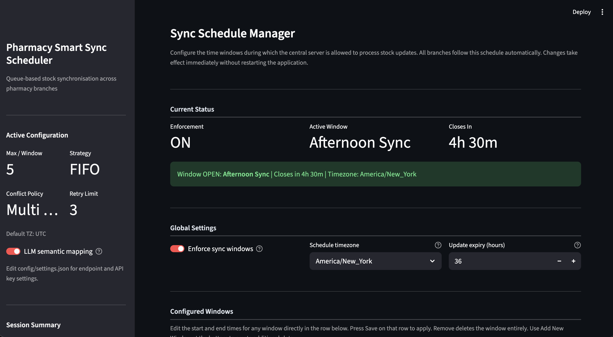
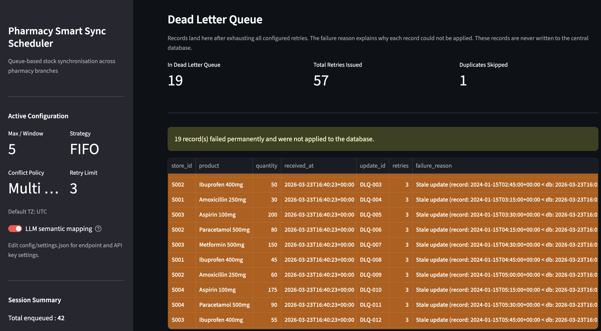

# Pharmacy Smart Sync Scheduler



A queue-based stock synchronisation system for multi-branch pharmacy networks. Branches upload stock update files during allocated sync windows. The central server validates, deduplicates, resolves conflicts, and writes a clean authoritative stock database — all without requiring any branch to maintain a persistent connection.

---

## Table of Contents

- [Overview](#overview)
- [System Architecture](#system-architecture)
- [Data Flow](#data-flow)
- [Project Structure](#project-structure)
- [Configuration](#configuration)
- [Sample Data Files](#sample-data-files)
- [How Timestamps Work](#how-timestamps-work)
- [Schema Mapping](#schema-mapping)
- [Conflict Resolution](#conflict-resolution)
- [Sync Windows and Scheduling](#sync-windows-and-scheduling)
- [Dead Letter Queue](#dead-letter-queue)
- [Running the Application](#running-the-application)
- [Regenerating Sample Files](#regenerating-sample-files)

---

## Overview



Pharmacy branches operate on limited server bandwidth. Each branch is allocated short sync windows every few hours during which it can submit stock updates. This system ensures that despite the narrow windows, restricted bandwidth, and the possibility of conflicting or duplicate data, the central stock database remains accurate at all times.

Key guarantees:

- Every record is processed at most once (idempotency across restarts)
- Conflicting updates for the same store and product are resolved deterministically
- Stale or expired updates are quarantined rather than silently applied
- Failed records are retried up to a configurable limit before being moved to a dead letter queue
- All sync operations are atomic — a failed batch rolls back completely, never leaving a partial write

---

## System Architecture

```
Branch Upload
     |
     v
data_loader.py          -- reads CSV, XLSX, or JSON into a DataFrame
     |
     v
schema_mapper.py        -- three-level column name normalisation
     |                     Level 1: exact synonym match
     |                     Level 2: high-specificity token match
     |                     Level 3: semantic keyword containment
     v
llm_mapper.py           -- LLM semantic fallback for columns that
     |                     survive all three rule levels unmapped
     v
validator.py            -- type checking, timestamp normalisation,
     |                     auto-generation of missing update_ids
     v
scheduler.py            -- FIFO or priority queue
     |                     stamps received_at (UTC) at enqueue time
     v
sync_engine.py          -- orchestrates each sync window
     |    |
     |    +-- Stage 0: expiry check via window_checker.py
     |    +-- Stage 1: idempotency filter
     |    +-- Stage 2: conflict resolution (conflict_resolver.py)
     |    +-- Stage 3: atomic apply with rollback on failure
     |    +-- Stage 4: retry or dead letter queue (retry_handler.py)
     v
Central Stock Database  -- one authoritative record per (store, product)
```

---

## Data Flow

1. A branch uploads a CSV, XLSX, or JSON file through the Upload tab.
2. The schema mapper normalises column names to the standard schema (`store_id`, `product`, `quantity`, `timestamp`, `update_id`). Non-standard names like `shop`, `drug_name`, or `Name of the medicine to be used` are resolved automatically.
3. The validator checks data types, drops rows with empty required fields or non-numeric quantities, and normalises any branch-provided timestamps to UTC.
4. Valid records are added to the queue. The scheduler stamps each record with `received_at` — the authoritative server receipt time in UTC.
5. When a sync window runs, the engine pulls a batch from the queue, checks for expired records, deduplicates by `update_id`, resolves within-batch conflicts, and writes the surviving records to the central database atomically.
6. Records that fail processing are retried up to `retry_limit` times. Records that exhaust retries, or that are too stale to be useful, are moved to the Dead Letter Queue for review.

---

## Project Structure

```
smart_sync_scheduler/
|
|-- app.py                          Entry point — run with: streamlit run app.py
|
|-- config/
|   |-- settings.json               Application configuration
|   |-- schema_mapping.json         Column synonym dictionary
|
|-- core/
|   |-- data_loader.py              File ingestion (CSV, XLSX, JSON)
|   |-- schema_mapper.py            Three-level rule-based column mapping
|   |-- llm_mapper.py               LLM semantic fallback mapper
|   |-- validator.py                Data validation and normalisation
|   |-- scheduler.py                Queue management (FIFO / priority)
|   |-- sync_engine.py              Sync window orchestrator
|   |-- conflict_resolver.py        Multi-level conflict resolution
|   |-- retry_handler.py            Retry logic and dead letter queue
|   |-- window_checker.py           Sync window enforcement and expiry
|   |-- utils.py                    Settings loader and DataFrame formatters
|   |-- logger.py                   Centralised logging
|
|-- data/
|   |-- sample.csv                  Standard column names, 22 rows
|   |-- sample.xlsx                 Non-standard column names, 12 rows
|   |-- sample.json                 Non-standard keys, 2 intentionally invalid rows
|   |-- sample_dlq_demo.csv         Stale timestamps for DLQ demonstration
|   |-- sample_dlq_demo.json        Stale timestamps, JSON format
|
|-- scripts/
|   |-- regenerate_samples.py       Restores sample files to original state
|
|-- requirements.txt
|-- README.md
```

---

## Configuration

All configuration lives in `config/settings.json`. The application reads this file on startup. Changes to `sync_schedule` take effect immediately through the Sync Schedule tab in the UI without a restart. All other changes require a restart.

```json
{
    "max_sync_per_window": 5,
    "conflict_policy": "multi_level",
    "retry_limit": 3,
    "scheduling_strategy": "fifo",
    "default_timezone": "UTC",
    "idempotency_store_path": "data/processed_ids.json",
    "log_file": "data/sync.log",

    "sync_schedule": {
        "enforce_window": true,
        "timezone": "Asia/Kolkata",
        "update_expiry_hours": 36,
        "windows": [
            { "label": "Morning Sync",   "start": "06:00", "end": "08:00" },
            { "label": "Afternoon Sync", "start": "14:00", "end": "16:00" },
            { "label": "Night Sync",     "start": "22:00", "end": "23:59" }
        ]
    },

    "llm": {
        "enabled": false,
        "provider": "openai",
        "endpoint": "https://api.groq.com/openai/v1/chat/completions",
        "model": "llama-3.1-8b-instant",
        "api_key": "",
        "timeout": 15,
        "confidence_threshold": 0.7,
        "rate_limit_per_minute": 10,
        "api_retries": 2,
        "cache_file": "data/llm_cache.json"
    }
}
```

### Key settings

| Setting | Description |
|---|---|
| `max_sync_per_window` | Maximum records pulled from the queue per sync cycle |
| `conflict_policy` | `multi_level` (default) or `latest_wins` |
| `retry_limit` | Times a failed record is re-queued before going to the DLQ |
| `scheduling_strategy` | `fifo` (default) or `priority` (prevents store starvation) |
| `update_expiry_hours` | Records older than this value are expired to the DLQ at sync time |
| `enforce_window` | When `true`, sync buttons are locked outside configured windows |

---

## Sample Data Files

### Normal operation

**sample.csv** — Standard column names (`store_id`, `product`, `quantity`, `update_id`). 22 rows across 4 branches and 5 products. Contains one deliberate conflict pair (UID-001 and UID-002 update the same store and product) and one duplicate `update_id` to demonstrate idempotency filtering.

**sample.xlsx** — Non-standard column names (`shop_id`, `drug_name`, `stock`, `version`). 12 rows. Demonstrates rule-based schema mapping where column names differ from the standard schema.

**sample.json** — Non-standard keys (`branch`, `medicine`, `qty`, `id`). 12 rows including two intentionally invalid: one with a non-numeric quantity, one with an empty store id. Demonstrates the validation pipeline.

### Dead Letter Queue demonstration

**sample_dlq_demo.csv** and **sample_dlq_demo.json** contain timestamps from January 2024. To trigger DLQ behaviour, set `update_expiry_hours` to a small value such as `1` in the Sync Schedule tab, upload one of these files, and run a sync window. All records will be expired to the DLQ because their `received_at` age exceeds the configured threshold.

### Recommended demo sequence

1. Upload `sample.csv` then run sync windows — shows conflict resolution and idempotency
2. Upload `sample.xlsx` then run sync windows — shows schema mapping with non-standard names
3. Upload `sample.json` then run sync windows — shows validation dropping two invalid rows
4. Open the Sync Schedule tab — configure windows, toggle enforcement, observe the live countdown
5. Set `update_expiry_hours` to `1`, upload `sample_dlq_demo.csv`, run a sync window — shows DLQ expiry

---

## How Timestamps Work

There are two distinct timestamp concepts in this system.

**received_at** (server-stamped, always UTC)
Set by the scheduler the moment a record enters the queue. This is the authoritative receipt time used for expiry checking and the full audit trail. Branches never provide this value — the server stamps it automatically at enqueue time. All `received_at` values are timezone-aware UTC datetimes stored in ISO 8601 format (`2026-03-23T09:43:43+00:00`).

**timestamp** (branch-provided, optional)
The time when the branch internally recorded this stock level. Useful for conflict resolution — when two updates target the same store and product, the one with the later branch timestamp wins. Branches can include this column if their POS system exports it, but it is never required. When absent, the column shows `NaT` in the audit log, which is expected and has no effect on processing.

This separation ensures that queue age (how long a record has been waiting) is always measured from server receipt time, not from whenever the branch happened to record the stock level.

---

## Schema Mapping

Branches rarely use the exact standard column names. The schema mapper resolves this through three progressive levels, applied in order for each column.

**Level 1 — Exact normalised match**
Column names are lowercased and separators (spaces, hyphens, dots, slashes) are replaced with underscores. The result is compared against the standard field names and a comprehensive synonym dictionary in `config/schema_mapping.json`.

Examples: `qty` → `quantity`, `shop` → `store_id`, `drug_name` → `product`

**Level 2 — High-specificity token match**
The column name is split into individual tokens. If any token is an unambiguously domain-specific signal for one field, the column maps to that field regardless of surrounding words.

Examples: `no. of pdts that are available` contains `pdts` → `quantity`; `Name of the medicine to be used by persons` contains `medicine` → `product`

Only tokens that could not plausibly appear as contextual words in another field's column names are used at this level. Generic words like `branch`, `stock`, and `units` are excluded because they appear in all types of column names.

**Level 3 — Semantic keyword containment**
Broader keyword signals evaluated in strict priority order: `update_id > timestamp > store_id > product > quantity`. The priority order prevents a weaker signal from overriding an unambiguous one — for example, `stock` inside `date of stock capture` does not override the unambiguous `date` timestamp signal.

**LLM fallback**
Columns that survive all three levels unmapped are sent to the configured LLM endpoint for semantic inference. The LLM is given the exact original column name strings, a plain-English description of each standard field, and a curated bank of 28 few-shot examples covering abbreviations, long descriptive names, camelCase, ALLCAPS, ERP-style names, and regional transliterations. Only validated mappings that meet the confidence threshold are used; all others fall back gracefully.

The LLM toggle is available in the sidebar and persists to `config/settings.json` without a restart.

---

## Conflict Resolution

Two records conflict when they target the same `(store_id, product)` pair within the same batch. The system resolves conflicts through three levels:

**Level 1 — Branch timestamp**
The record with the later branch-provided `timestamp` wins. This represents the most recently observed stock level.

**Level 2 — update_id lexicographic comparison**
When timestamps are equal or absent, the record with the lexicographically higher `update_id` wins. This provides a deterministic tiebreaker without relying on arrival order.

**Level 3 — Last write wins**
When both `timestamp` and `update_id` are equal, the last record in arrival order wins.

Duplicate `update_id` values within a single batch are deduplicated before conflict resolution runs — only the last occurrence survives. Cross-session idempotency is maintained by a persistent `data/processed_ids.json` store that survives application restarts.

Out-of-order detection runs after conflict resolution. If an incoming record's timestamp is older than the currently stored value for that `(store_id, product)` pair, the record is treated as a failure, retried up to `retry_limit` times, and moved to the DLQ if retries are exhausted.

---

## Sync Windows and Scheduling



The Sync Schedule tab provides full control over when the server accepts processing.

**Window enforcement** — when enabled, the Run Sync Window, Simulate, and Run Until Empty buttons are locked outside configured windows. An emergency override is available for out-of-hours processing.

**Window configuration** — the default schedule has three windows (Morning, Afternoon, Night). Start and end times for each window are editable directly in the UI without touching `config/settings.json`. New windows can be added and existing windows removed. Overlap detection prevents misconfiguration.

**Live countdown** — the page auto-refreshes every 10 seconds via a browser-initiated timer, so the current window status and countdown display remain accurate without user interaction.

**Priority scheduling** — when `scheduling_strategy` is set to `priority`, stores with fewer total submissions receive higher queue priority. This prevents a high-volume branch from monopolising every sync window and starving smaller branches.

**Expiry** — records that have been queued longer than `update_expiry_hours` without being processed are expired to the Dead Letter Queue when the next sync window runs. Expiry is measured from `received_at` (server receipt time), not from the branch-provided timestamp.

---

## Dead Letter Queue



Records land in the Dead Letter Queue under three conditions:

- The record exhausted all retries after repeated processing failures
- The record was flagged as out-of-order (its timestamp is older than the current database value) and retries did not resolve it
- The record had been queued longer than `update_expiry_hours` without being processed

Dead Letter Queue entries are visible in the Dead Letter Queue tab with the failure reason, retry count, and `received_at` time. They are never written to the central database. The failure reason breakdown chart categorises entries by type (stale or out-of-order, processing error, or other) for operational review.

---

## Running the Application

### Requirements

```
streamlit >= 1.32.0
streamlit-autorefresh >= 0.0.1
pandas >= 2.0.0
plotly >= 5.18.0
openpyxl >= 3.1.0
requests >= 2.31.0
pytz >= 2023.3
```

### Installation

```bash
python3 -m venv venv
source venv/bin/activate        # on Windows: venv\Scripts\activate
pip install -r requirements.txt
```

### Starting the application

```bash
streamlit run app.py
```

The application opens at `http://localhost:8501` by default.

### Changing configuration

Edit `config/settings.json` and restart the application for most settings. Changes to `sync_schedule` (windows, enforcement, timezone, expiry) can be made through the Sync Schedule tab and take effect immediately without a restart.

---

## Regenerating Sample Files

The fresh sample files (`sample.csv`, `sample.xlsx`, `sample.json`) contain no timestamps and are always valid regardless of when the demo is run. If the files are modified and need to be restored:

```bash
python3 scripts/regenerate_samples.py
```

The DLQ demo files (`sample_dlq_demo.csv`, `sample_dlq_demo.json`) are never touched by this script. Their 2024 timestamps are intentional — they exist specifically to trigger the expiry path.